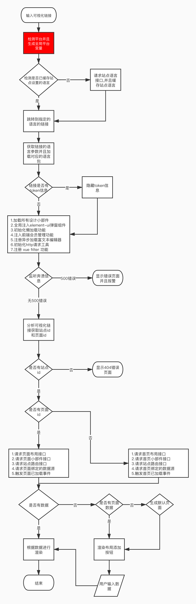
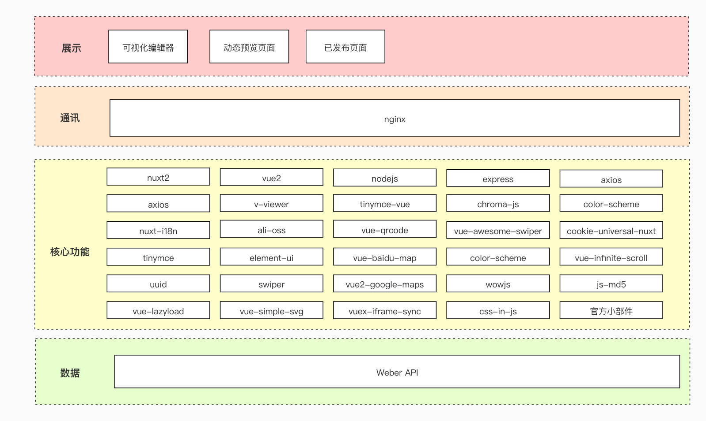

# 框架架构

## 流程图

## 架构图

## 自动部署

待补充

## 未来规划

- [x] 加入 `typescript` 框架
- [ ] 把所有 `javascript` 软类型替换为`typescript`强类型
- [ ] 小部件拆分独立项目维护管理
- [ ] 加入 `tailwindcss` 统一 css 框架`
- [ ] 加入接口模拟拦截器,方便测试
- [ ] 加入单文件测试
- [ ] 加入组件测试
- [ ] 加入端到端 (E2E) 测试
- [ ] 重构框架本地化功能
