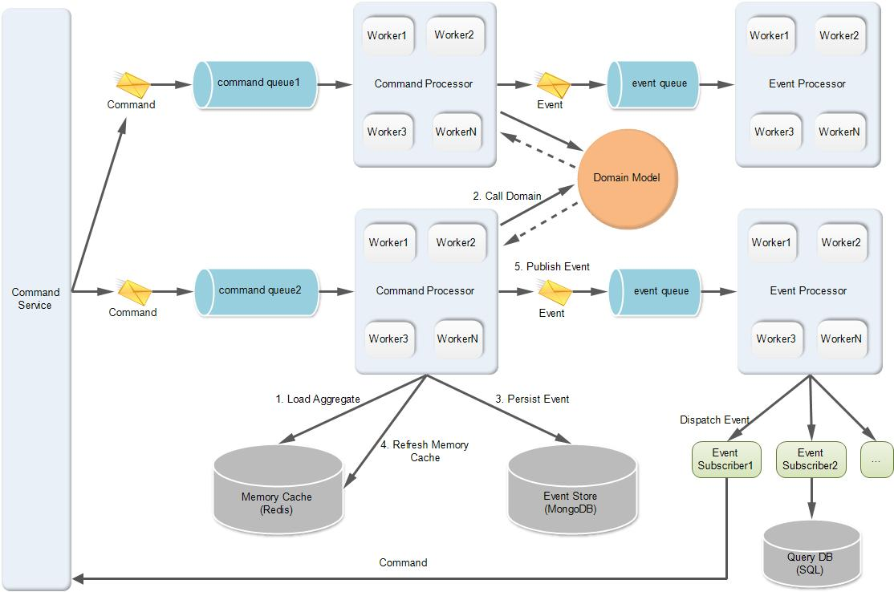

# 框架架构

## 解决了哪些问题?

---

1. xxxx
2. xxxxxx

### 业务流程

图中xx入口.............

### 任务总览

---

- [x] 使用 `dotenv-module`  统一存储环境变量
- [x] 使用 `eslint`,`stylelint`,`prettier` 统一代码风格
- [x] 使用 `axios` 统一接口请求工具
- [x] 使用 `axios-mock` 模拟接口生成测试数据
- [x] 使用 `jest` 统一单元测试工具
- [x] 使用 `jest` 统一单元测试工具
- [x] 添加 `i18n` 实现项目的多语言
- [x] 添加 `css-in-js` 实现项目的样式可视化编辑
- [x] 选择 `tailwindcss` 做 css 框架`
- [ ] 使用typescript
- [x] ~~使用拖拉技术~~
